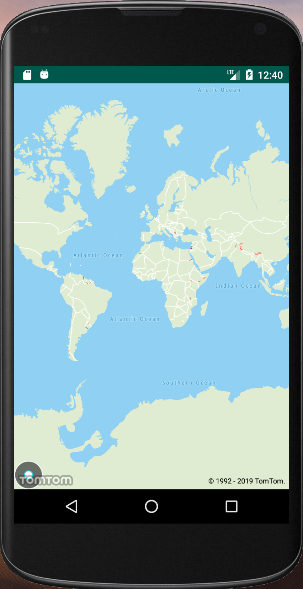

## :keyboard: Activity: Install the app on your Android phone

1. Run the following command in your terminal:
    ```bash
    ./gradlew installDebug
    ```
    More details can be found in the [official Android documentation](https://developer.android.com/studio/build/building-cmdline#DebugMode).
1. Once the app is installed on your device you should see something like this:

    
